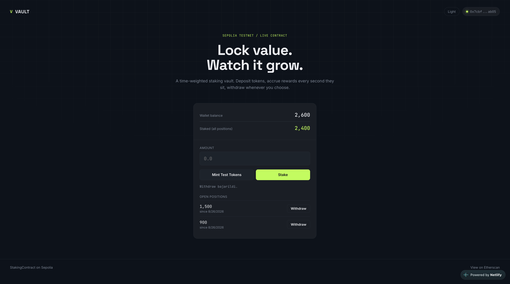

# Staking DApp

A full-stack decentralized staking application: a Solidity staking contract (built and tested with Foundry) paired with a React + ethers.js frontend, deployed live on Sepolia testnet.

## Overview

Users stake ERC20 tokens, and rewards accrue linearly based on how long each stake has been active. The contract owner funds a reward pool separately from the staking mechanism, keeping user principal and protocol rewards cleanly separated. The frontend lets anyone connect a wallet, mint test tokens, stake, and withdraw — all against the live Sepolia deployment.

## Live Deployment (Sepolia Testnet)

| Contract | Address |
|---|---|
| StakingContract | [`0xf196E6f2A1DC17bb381995Cd0A2C50Dc335bb0d5`](https://sepolia.etherscan.io/address/0xf196E6f2A1DC17bb381995Cd0A2C50Dc335bb0d5) |
| MockERC20 (test token) | [`0xcE53bDBC26b23bEccEa3203C8B4555d7b75b82e8`](https://sepolia.etherscan.io/address/0xcE53bDBC26b23bEccEa3203C8B4555d7b75b82e8) |

## Features

- **Stake** — deposit ERC20 tokens, tracked per-user with individual timestamps
- **Fund Rewards** — top up the reward pool independently of staking
- **Withdraw** — returns principal + accrued reward; reward is capped to whatever remains in the pool, so a user's principal is never locked even if the pool runs dry
- **Owner-controlled reward rate** — only the contract owner can adjust the reward rate, with safe ownership transfer (zero-address protected)

## Security

- **Checks-Effects-Interactions pattern** in `withdraw()` — state is updated (array pop, reward pool deduction) *before* the external token transfer, preventing reentrancy
- **Reentrancy tested directly** — `test/MaliciousToken.sol` simulates a malicious ERC20 that attempts to re-enter `withdraw()` during the transfer callback; the attack correctly reverts
- **Reward pool depletion handled gracefully** — if accrued reward exceeds the pool, the user still receives their full principal plus whatever reward is available, rather than reverting and locking their funds
- **Transfer return values checked** — all ERC20 transfers use `require()` to guard against tokens that fail silently instead of reverting
- **Access control** — reward rate changes and ownership transfer are restricted to the contract owner via a gas-optimized `onlyOwner` modifier; ownership transfer rejects the zero address to prevent permanently locking admin functions

## Gas Optimization

Deployment cost reduced by ~9.5% (1,196,384 → 1,083,109 gas) through:

- **`immutable` for `STAKING_TOKEN`** — avoids storage reads on every token interaction, since the address never changes after deployment
- **Extracted modifier logic** — `onlyOwner` calls an internal `_onlyOwner()` function instead of inlining the check, reducing bytecode duplication across multiple protected functions
- **Storage references in `withdraw()`** — caches `stakes[msg.sender]` as a local `storage` pointer instead of re-reading the mapping on every array access

All tests pass after each optimization — verified with `forge test --gas-report` before and after.

## Tests

10 Foundry tests covering functionality, security, and access control:

| Test | Purpose |
|---|---|
| `test_Stake` | Verifies staking updates balances and storage correctly |
| `test_Withdraw` | Full withdraw flow: principal + reward calculation |
| `test_WithdrawWithInsufficientRewardPool` | Confirms principal is never locked, even with an empty reward pool |
| `test_RevertWhen_InvalidIndex` | Rejects withdrawals on non-existent stakes |
| `test_RevertWhen_StakeZeroAmount` | Rejects zero-amount stakes |
| `test_ReentrancyProtection` | Simulates a live reentrancy attack via a malicious token and confirms it fails |
| `test_SetRewardRate_Owner` | Confirms the owner can update the reward rate |
| `test_RevertWhen_SetRewardRate_NotOwner` | Rejects reward rate changes from non-owners |
| `test_TransferOwnership` | Confirms ownership transfers correctly |
| `test_RevertWhen_TransferOwnershipToZeroAddress` | Rejects transferring ownership to the zero address |

## Project Structure
staking-project/
├── src/ # Solidity contracts
│ ├── StakingContract.sol
│ └── MockERC20.sol
├── test/ # Foundry tests
│ ├── StakingContract.t.sol
│ └── MaliciousToken.sol # Reentrancy attack simulation
├── script/
│ └── Deploy.s.sol # Sepolia deployment script
└── frontend/ # React + ethers.js UI
└── src/
├── App.tsx
└── contract.ts # Contract addresses + ABIs


## Running the contracts locally

```bash
forge build
forge test -vvv
forge test --gas-report
```

## Running the frontend

```bash
cd frontend
npm install
npm run dev
```

Requires MetaMask connected to Sepolia testnet.

## Frontend

A React + TypeScript UI for interacting with the deployed contract:

- **Wallet connect** — MetaMask integration with auto-reconnect on page reload and live account-change detection
- **Mint test tokens** — mints MockERC20 for testing on Sepolia
- **Stake** — handles the approve + stake flow in sequence
- **Open positions** — lists each stake individually (not just the first), with a dedicated withdraw button per position, since the contract's swap-and-pop removal means position indices shift after each withdrawal
- **Live balance display** — wallet balance and total staked amount update automatically after every transaction
- **Dark/light theme** — follows system preference automatically, with a manual toggle
- **Responsive** — works down to mobile viewport widths

## Live Demo

[View the live app](https://vaultstakingdapp.netlify.app/)

## Stack

- Solidity ^0.8.20
- Foundry (forge)
- React + TypeScript (Vite)
- ethers.js v6